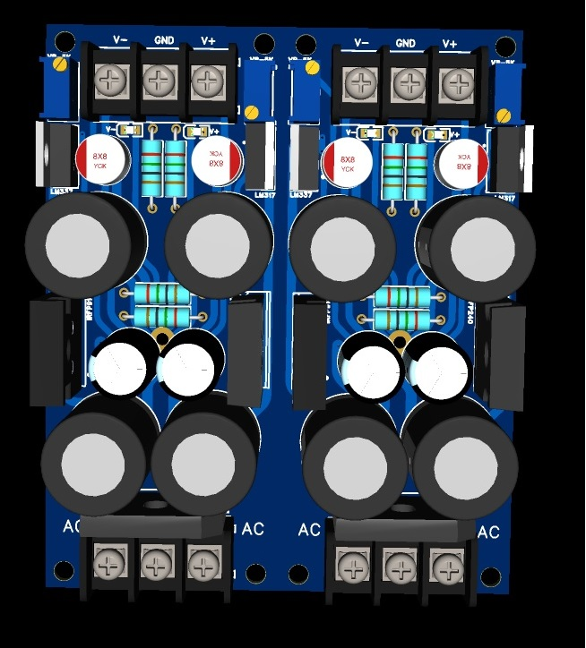

## Overview  
  
In this directory there will be brief explanation and screen shot of regulated capacitance multiplier project
  
## Design Goal 
* It should able to supply 1A Regulated output and 2A Minimum for unregulated output.
* Should be  easy to assembly and procure it's component.
* Small enough to be retro fitted into existing product or design.
* drastically suppress power supply AC ripple and hum.
  
## Design Approach 
* **Mosfet Source Follower**: The circuit relies in single IRF240 or IRFP9240 for negative rail that act as voltage follower,The MOSFET acts as a voltage follower.
* **RC Gate Filter**: A simple RC network filters the voltage feeding the gate of the MOSFET. Because the MOSFET gate has an exceptionally high input impedance, it draws virtually no current. This allows the small, high-quality filter capacitor at the gate to electronically behave as if it were hundreds of times larger, heavily dampening ripple before it passes to the output.
* **Regulated output**: Capacitance multiplier output are swing wildly depend on the load demand, by adding LM317 and LM337 regulator, at the cost  of limiting current handling but a provision for un regulated output are provided, for current heavy and un regulated load.

## PCB Screenshots 

  

