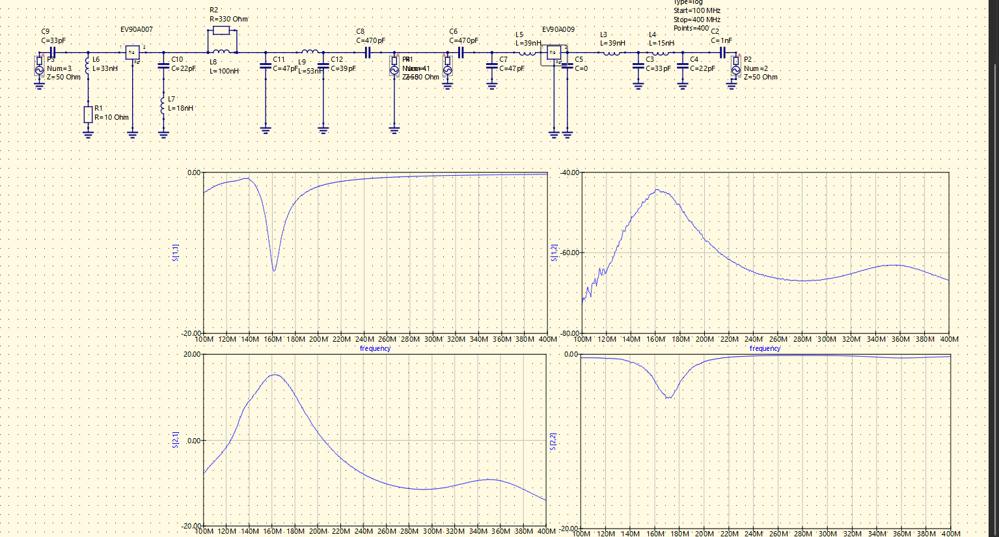
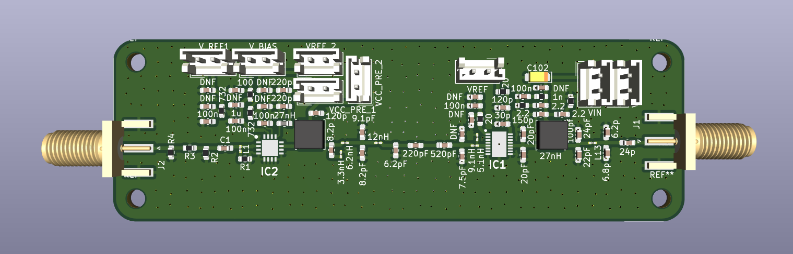

## Overview  
  
In this directory there will be brief explanation and screen shot of cascading RF Amplifier based on CMX90A9007/CMX90A9009.
  
## Design Goal 
This amplifier are intended as a prototyping platform for CMX90A9007/009 to evaluate if it suitable to be integrated into client's AIS amplifier board , that mean it only needs the bare minimum such as easily accessible and modifiable footprint and test point, and easy connection to test equipment while still able to operate efficiently in AIS band (~136 MHz)

## Design Approach 
In this project I familiar myself with QUCS-S, it akin to LTSPICE or TI-TINA but with capability to simulate RF circuit, with QUCS-S began simulate rough value for filter shown picture below:

  

As the picture shown, it utilized series-shunt for the driver input, by using 33pF capacitor as input coupling capacitor, then connected on input node are 33nH inductor in series with 10 ohm resistor to ground to provide stabilization along with another shunt 22pF and 18nH connected in series on output node for output matching , following driver output the network transistion into multiple segment pi filter designed for interstage impadance matching consted of C11 (47 pF), series inductor L9(53 nH),and shunt capacitor C12(39 pF). AC coupling maintained using C8(470pF) before entering the input matching side of the final stage.
Emerging from the CMX90A009, the network uses series-inductor and shunt-capacitor pi structure to provide both output impedance transformation and harmonic rejection(low-pass/bandpass filtering), this also include series inductor This includes series inductor L5 (39 nH) (with parallel/alternate branches like L3 (39nH and L4 = 15nH forming composite inductive paths).Shunt capacitive loading is distributed via C7 (47 pF), C3 (33 pF), and C4 (22 pF).Finally, the signal passes through a DC-blocking output capacitor C2 (1 nF) to the output

While the simulation S-parameter response curves spanning from 100 MHz to 400 MHz demonstrate a highly tuned narrowband response centered precisely at 160 MHz. Both the input (S{11}) and output (S22) return loss plots reveal deep reflection notches dropping below -15 dB at 160 MHz, indicating excellent impedance matching and minimal signal reflection at the target frequency. Furthermore, the forward transmission coefficient (S21) exhibits a strong bandpass gain peaking at approximately +12 dB to +14 dB within the passband, while rolling off steeply outside this region to suppress out-of-band signals and harmonics. But the real world value still can be change and tuned as the real world value for component are affected by the PCB trace,stack up and general layout itself.

## PCB Screenshots  

  

