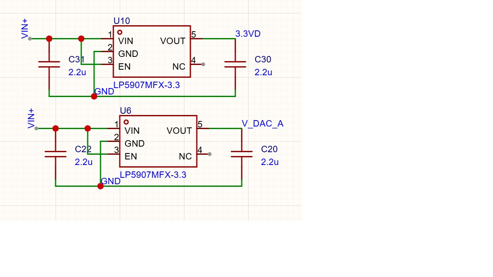
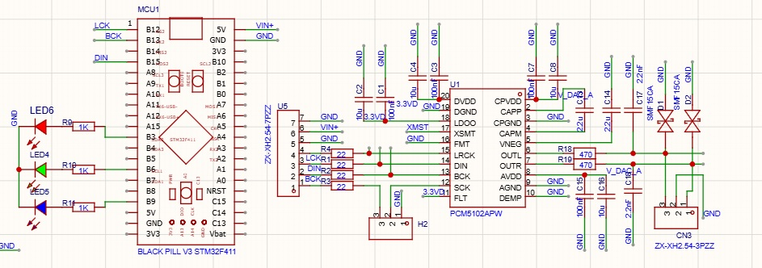
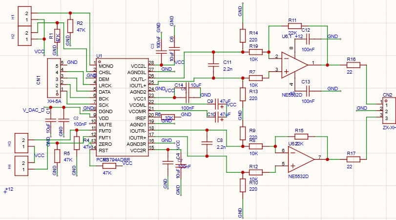
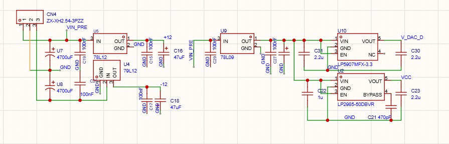
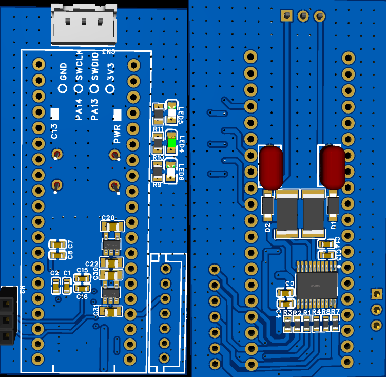

## Overview  
  
In this directory there will be brief explanation and screen shot of PCM1792 and PCM5102 DAC
  
## Design Goal (PCM5102)
Main design goal for this DAC are mainly simplicity while retaining good audio output quality, and for this reason PCM5102 are choosen and here's why it made for good choice:
* **Simple Output Stage** it doesn't need I/V stage due to being already GND centered line level output, thanks to it's internal charge pump. This allows the chip to output a true 2.1VRMS audio signal directly, completely eliminating the need for expensive DC-blocking capacitors or an external operational amplifier (Op-Amp) stage.
*  **No Master Clock Required:** Thanks to an internal audio PLL, it can derive its own master clock directly from the I2S Bit Clock (`BCK`). This simplifies 3-wire I2S setups (like connecting to an ESP32 or Raspberry Pi) and eliminates complex external clock routing.
* **Simple PSU Implementation** PCM5102 can run with single 3.3V LDO with decent performance,but for better THD and Noise figure it's best to use two local regulator (3.3V Digital and 3.3V Analog).

## Design Goal (PCM1794)
The second iteration of this DAC are remained hardware controlled to ease the further hardware development but the goal are now toward improving the sonic quality for the DAC, and listed below are the main design goal for this second revision of the DAC:
-   **High Dynamic Range:** Deliver an wide dynamic range  to capture the quietest details and largest peaks in audio.
-   **Low Noise and Distortion:** Maintain extremely low total harmonic distortion (THD+N) for clean, transparent sound reproduction. 
-   **Balanced Current Output:** Provide current differential outputs shifting the burden of analog conversion and filtering to an external I/V (current-to-voltage) stage optimized by the designer. 
- **Hardware Control Mode** Hardware control mode provide a easy way to control DAC behavior to experiment and setup the DAC to work with the USB to I2S board.

For this reason PCM1794 are choseen for this revision while chip selection are just one part of the equation of making good DAC (other  are good layout and power supply) chip selection are also important to determine the DAC behavior and how it would interact with USB to I2S module.

## Design Approach (PCM5102)
PCM5102 board are consisted of 2 layer PCB that act as the WeAct's Black Pill shield board, where the development board attached above the DAC PCB, as shown the screenshot section, for the power supply section shown below:

  

The power supply are pretty simple as it consisted of Black Pill 5V sourced,two  3.3V LDO to feed digital and analog section separately, while PCM5102 can operate just fine with single LDO using two local LDO for each section improves it's performance.

  

DAC implementation it's self are pretty standard but the component choice are especially critical for the output filter, utilizing MELF film resistor and film capacitor as shown at the PCM5102 screenshot to ensure tighter tolerance for output filter.
## Design Approach (PCM1794)
The PCM1794 board are consisted of 4 layer PCB and two main part the DAC and the PSU, the top side consisted of the DAC and the I/V Converter, and the bottom layer are consisted of the pre regulator , 12+/12- and the LDO for the DAC, the main reason for putting the PSU on bottom layer and using 4 layer PCB are to ensure best isolation from PSU to DAC which prevent the noise from traveling through the sensitive part of the DAC such as the analog output, the DAC part are mostly same as the TI's existing schematic but the power supply are quite different since it's use bipolar 15V.

  

As the image shown below there are regulator turning the filtered bipolar 15V to +/-12V those regulated for I/V stage opamp, the +12V the continues to feed the 78L09 who act as the LDO's pre regulator ,the main function of the pre regulator to help reduce the power dissipation of the LDO (LP5907MFX-3.3/LP5907MFX-5.0) and further reduce the noise prior given to the LDO.

  

## PCB Screenshots  (PCM5102)

  

## PCB Screenshots (PCM1794)

  

