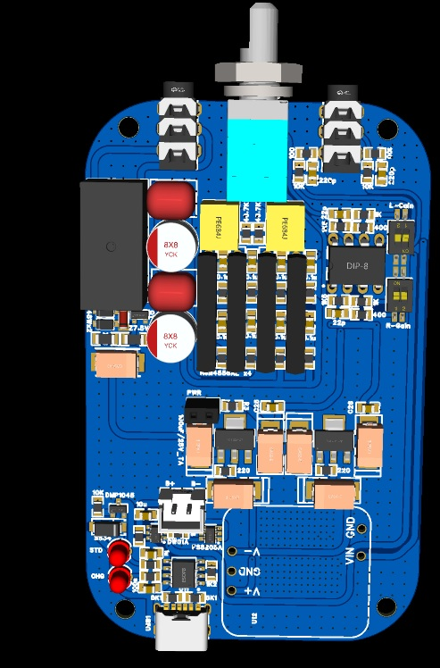
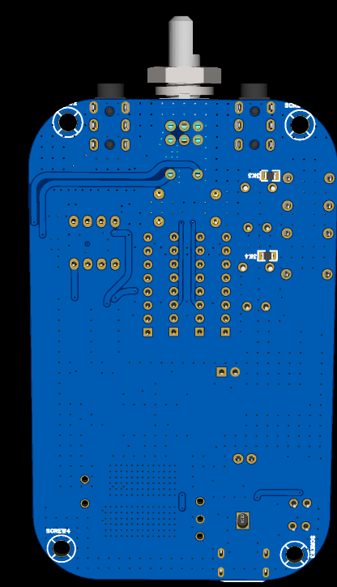
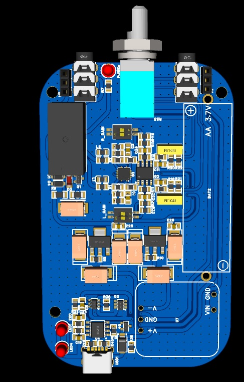
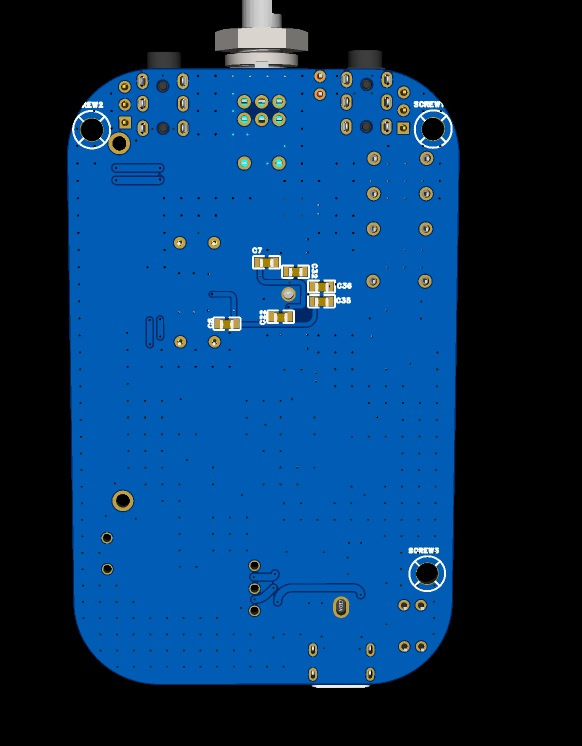

# Overview  
  
In this directory there will be brief explanation and headphone amplifier design screenshots based on Two-Stage VFB (Voltage Feedback) using OPA1612 as a gain stage and 4x NJM4556 as buffer and VFB(Voltage Feedback)/CFB(Current Feedback) composite headphone amplifier based on OPA1602/TPA6120A2 both are designed to fit inside a regular over the shelf altoids tin can container  
  
# Design Goal (Two-Stage VFB and VFB/CFB Hybrid)  
* It should be able to fit into altoids can.  
* Enough power to drive 50 Ohms Planar headphones while providing clean power to high-sensitivity IEM.  
* User adjustable gain.  
* Should provide low enough output impedance.  
* Part should be easily available.  
* Should be bipolar supply  
  
# Design Approach (Two-Stage VFB)  
* The design is split into two sections (gain and buffer) with a potentiometer in the middle, to mechanical scratching noise by isolating DC from leaking into the buffer section by using capacitor coupling after the potentiometer and improving background noise performance.  
* The Amplifier uses local negative feedback because it provides excellent stability and inherently provides predictable gain while using loose tolerance part.  
* OPA1612 provides low noise performance while keeping low bias current (60 nA) which in turn provides low DC offset.  
* NJM4556 provides good current output (70 mA) and, with research, NJM4556's internal are well-matched and by paralleling 4 of them and using 1 ohm resistor it should achieve the desired high current output (200mA and 0.5Ohm output impedance).  
* To achieve bipolar supply, there are two approaches: using a dual 9V battery or using bipolar step up. In this design we use the shelves bipolar step power supply made by Raelis Labs that has been proven to be able to provide amplifier current needs.
# Design Approach (VFB/CFB Hybrid)  

* It uses two separate stages: OPA1602 as a gain section and TPA6120A2 are configured as unity gain with local NFB.  
* The main downside of TPA6120A2 is that it requires a 10 ohm isolation resistor which causes plenty of modern low-impedance IEM/headphones to change its frequency response, but it could be mitigated by using ferrite beads that act as a near-zero inductance and near zero resistance cable at audio frequency that bypass 10 ohm resistor but act as lossy elements that suppresses EMI while being isolated safely by the 10 ohm resistor.  
* TPA6120A2 dissipates a lot of heat, so it requires to be connected directly to the ground plane. Ground plane also heavily improves amplifier THD and noise by eliminating inductance and parasitic loops, which are the main issue on high speed analog or digital circuits.
# PCB Screenshots (Two-Stage VFB)

# PCB Screenshots (VFB/CFB Hybrid)

  
  

